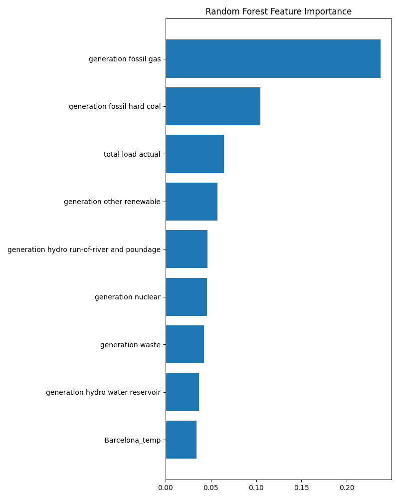
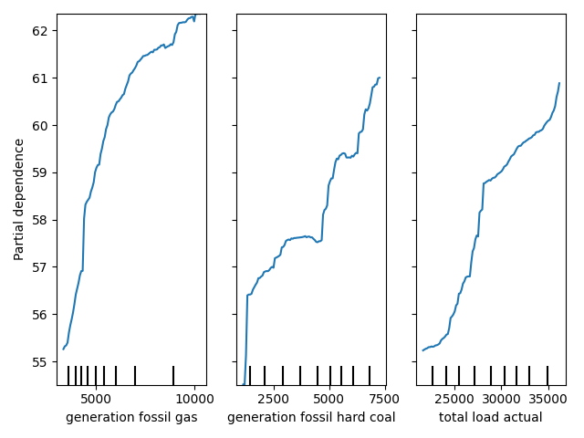

# capstone2
## Motivation

For many years, solar panels and wind turbines have been hailed as the harbinger of a renewable energy revolution that has only just very recently begun to take shape on a global scale.  The chief complaint from those hesitant to adopt or incorporate renewable energy sources was almost always their effect on energy prices.  At the time of writing, the world is engulfed in a novel Coronavirus pandemic that has shut down industry and social interaction around the globe.  As viral videos of crystal clear streams and suburban big cats make theur way around the world, many are starting to think more seriously about our impact on the planet

With a fair bit of inspiration from a [recent paper on *Tackling Climate Change with Machine Learning*](https://arxiv.org/abs/1906.05433), I have made an effort to better understand the forces that act upon energy prices. In this analysis I endeavor to build a model that can predict energy prices based on generation and weather data and, hopefully, provide some insight as to how renewables affect those prices.

## Data
This publicly available dataset came in two seperate .csv files (weather and energy) posted on [Kaggle](https://www.kaggle.com/nicholasjhana/energy-consumption-generation-prices-and-weather#weather_features.csv) in mid 2019.  Some previous work has been done wit this data to understand the effect of time on energy prices, but I was more interested in determining the effect of different energy generation mixtures and weather.  As such, the following analysis does not consider the effects of the time-series on price.

The combined dataset contained 178,000 rows of hourly data between January 2015 and Deember 2018. The target of my predictions was real-time energy price in EUR/MWh provided by the energy csv.

The weather dataset contained temperature, humidity, pressure, wind speed and more data for the 5 largest cities in Spain: Madrid, Barcelona, Valencia, Sevilla, Bilbao.

       

credit: https://www.alicante-spain.com/images/map-of-spain.jpg

This dataset was relatively clean save for the ' ' in front of 'Barcelona' in every row, as well as what appeared to be a broken pressure gauge for about a month in Barcelona.

The energy dataset concerned generation in MW for various energy sources throughout the country.  This dataset was incomplete in a few areas, namely that the 'generation fossil coal-derived gas', 'generation fossil oil shale', 'generation fossil peat', 'generation geothermal', and 'generation marine' contained only zeros, and 'generation hydro pumped storage aggregated' contained all null values. 

## Pipeline and Workflow

I gave myself the challenge of working with the AWS suite on this project, taking the opportunity to gain familiarity with these widely used tools.  I stored my data and wrote results remotely into an S3 bucket, and did all model training and manipulation on the full dataset in and ubuntu t2.small EC2 instance with anaconda3 and git.  I wrote code mostly on my local machine, making small adjustments in vim on the EC2 instance when necessary.  I followed a basic git workflow, essentially treating my local and virtual machines as if they were partners working on the same project.

I created a Pipeline class to load data in from S3 (using the s3fs library) and apply the necessary cleaning and transformations.  I also worked a bit with SKlearn's built-in Pipeline class.  The biggest speed-bump at this stage was turning the 'city_name' feature into a series of features that represented weather data for each city.  While this solved the probem of having duplicate indices (one for each city at each timestamp), it sent my dimensionality skyward very quickly.

## EDA

EDA turned out to be very useful for narrowing down my long list of features into something a bit less computationally expensive and more interpretable.

I had a suspicion that weather_description and weather_id were redundant as they contained a similar number of categories.  Some simple exploration confirmed this and found additional collinearity/sub categorization in the weather_main column, clear upon moderately close inspection:

| Weather Description          | Weather ID | Weather 'main' |
|------------------------------|------------|----------------|
| sky is clear                 | 800        | clear          |
| few clouds                   | 801        | clouds         |
| scattered clouds             | 802        | clouds         |
| broken clouds                | 803        | clouds         |
| overcast clouds              | 804        | clouds         |
| light rain                   | 500        | rain           |
| moderate rain                | 501        | rain           |
| heavy intensity rain         | 502        | rain           |
| light intensity shower rain  | 520        | rain           |
| heavy intensity shower rain  | 522        | rain           |
| shower rain                  | 521        | rain           |
| very heavy rain              | 503        | rain           |
| thunderstorm with heavy rain | 202        | thunderstorm   |
| thunderstorm with light rain |  200       | thunderstorm   |
| proximity thunderstorm       | 211        | thunderstorm   |
| thunderstorm                 | 211        | thunderstorm   |
| light intensity drizzle      | 300        | drizzle        |
| mist                         | 701        | mist           |
| fog                          | 741        | fog            |

weather_description and weather_id match nearly 1:1, and weather_main contains faily intuitive groupings of weather types.  I opted to one-hot encode weather_main and discard the other two to minimize dimensionality.

#### Correlation Matrices

To avoid making a single, massive, unreadable correlation matrix with all of my features, I decided to add price to the weather DataFrame and make a separate, moderately-readable one for each subset.  When it comes to weather, it appears that wind speed and temperature are the only features which are routinely correlated with energy price (bottom row).

Energy

The energy dataset provides a much more visually interesting (and analytically helpful) matrix.  Lignite, gas, coal, and oil generation , along with total load, all appear positively correlated with price.  Meanwhile, onshore wind and pumped storage consumption appear to be negatively correllated with price.

### Model Selection

#### Random Forest
From the outset, I was planning on using a random forest regressor on this data.  After first running the regressor with default parameters, I quickly found that I could save on computation with very little increase in error.  The elbow of this MSE plot is around 10 estimators, and the MSE value is nearly the same as MSE at 100 estimators (the default).

A GridSearchCV reported 30 as the optimum number of estimators.  Running my RandomForest with 30 estimators produced surprisingly high r^2 scores for both my train and test data, **0.97** and **0.82** respectively.  These were good results, but I came away from them concerned that I had introduced some leakage that was causing my model to overfit.

#### SKlearn Pipeline
To address these concerns, I used SKlearn's pipeline class to compare my random forest with 3 other models.  The similarity between results from the sklearn pipeline and my own reassured me that I had not caused any leakage with my treatment of the standardization and train-test-split in my custom pipeline.  

| Model                 | Train R^2 | Test R^2 | OOB Score   |
|-----------------------|-----------|----------|-------------|
| RandomForestRegressor | 0.97      | 0.83     | 0.81        |
| Lasso(alpha=0.03)     | 0.44      | 0.43     |             |
| Ridge(alpha=0.03)     | 0.44      | 0.43     |             |
| LinearRegression      | 0.44      | 0.43     |             |

These results indicate that the relationships at play between the features and the target are not linear, and that in order to get highly interpretable results from a Linear Model, significant feature engineering would be required.

## Interpretation
#### Feature Importance
I hoped to gain insight into the effect of my features on energy price by plotting the feature importances for my RandomForestRegressor.  The results of this are shown below, with gas and coal generation leading the list, followed by total load (demand), hydropower, and a feature called 'generation other renewable' on which the data documentation sheds unfortunately little light.

#### Partial Dependence
While the feature importance shows the magnitude of a feature's effect on price, it does not tell us anything about directionality.  Partial dependence plots help to shed some light on how some of these features impact energy prices.

Here we see the top three most important features, each clearly with a positive effect on price.

By far the most significant weather metric in the dataset, wind speed in madrid has a strong negative correlation with energy price.

Interesting step behavior with solar generation and some very strange behavior in the 'other' category.

Perhaps the most insightful plot, hydro pumped storage just misses the top ten feature importances, but since pumped storage is often used in concert with renewables, it may be a good sign for the future of renewables.

## Next steps
#### Apply this model to U.S. Data
A this point we have a model that performs quite well at predicting energy prices given generation statistics and a few key weather metrics.  With a chance to expand on this process I would hope to apply this model to a united states dataset.  

#### Optimize price to reduce GHG emissions
Once we can predict energy prices given data about which energy sources are generating power, I believe the most utility can be found in reverse engineering the process to find prices that produce the fewest GHG emissions.  This information would be incrediblt useful to governing and regulatory bodies, as well as public utiities.